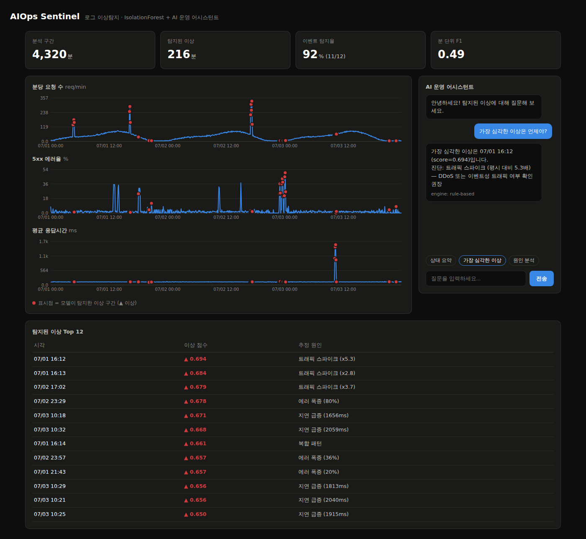

# AIOps Sentinel — 로그 이상탐지 + AI 챗봇 프로젝트

서버 로그에서 장애 징후(에러 폭증, 지연 급증, 트래픽 스파이크)를 머신러닝으로 찾아내고,
탐지 결과에 대해 질문할 수 있는 챗봇을 붙여본 개인 프로젝트입니다.

머신러닝을 공부하면서 "모델을 학습시키는 것"에서 끝나는 게 아쉬워서,
실제로 화면에서 돌아가는 서비스 형태까지 만들어 보는 것을 목표로 했습니다.



## 만든 것

- **로그 생성기**: 실제 서버 로그를 구할 수 없어서, 하루 트래픽 패턴을 흉내 낸 가짜 로그를
  직접 만들었습니다. 장애 상황 12개를 일부러 섞어 넣어서 나중에 채점(평가)에 사용했습니다.
- **이상탐지 모델**: IsolationForest를 사용했습니다. 처음에는 지도학습을 생각했는데,
  실제 회사에서는 "이때가 장애였다"라는 라벨 데이터가 거의 없다는 걸 알게 되어
  라벨 없이 학습하는 비지도 방식으로 바꿨습니다.
- **대시보드**: Flask로 API를 만들고, 차트는 라이브러리 없이 직접 그려봤습니다.
- **챗봇**: "가장 심각한 이상은 언제야?" 같은 질문에 탐지 결과를 근거로 답합니다.
  LLM API 키가 있으면 LLM을 쓰고, 없으면 미리 만든 규칙으로 답하게 했습니다.

## 결과

72시간 분량 로그(약 18만 줄)에 숨겨둔 장애 12건 중 **11건을 탐지**했습니다 (91.7%).
분 단위로 보면 precision 0.47 / recall 0.51 정도로, 장애 구간의 시작과 끝 부분에서
오탐과 미탐이 생기는 걸 확인했습니다. 이 부분은 아직 개선 중입니다.

## 실행 방법

```bash
pip install -r requirements.txt
python data/generate_logs.py          # 1. 가짜 로그 생성
python src/train.py --contamination 0.05   # 2. 학습 + 평가
python app.py                         # 3. http://localhost:5000 접속
```

## 만들면서 배운 것 / 삽질 기록

- **절대값 피처의 함정**: 처음에는 요청 수, 지연시간을 그대로 피처로 썼는데,
  새벽(트래픽 적음)과 낮(트래픽 많음)의 차이를 전부 이상으로 판단해버렸습니다.
  고민 끝에 "직전 5분 평균 대비 몇 배인가"라는 변화율 피처를 추가해서 해결했습니다.
- **임계값 버그**: 탐지 민감도 파라미터(contamination)를 아무리 바꿔도 결과가
  똑같아서 한참 헤맸는데, 임계값을 0.98 분위수로 하드코딩해둔 게 원인이었습니다.
  파라미터와 연동되도록 고치면서 IsolationForest의 score 개념을 제대로 이해하게 됐습니다.
- **평가 지표 고민**: F1 점수만 보면 낮아 보이는데, 실제 운영 입장에서 생각해보면
  "장애가 난 것 자체를 놓쳤는가"가 더 중요할 것 같아서 구간 단위 탐지율을 따로 계산했습니다.
- **시간대 피처 실패**: 시간대(sin/cos) 피처를 넣으면 오탐이 줄어들 거라 기대했는데
  오히려 탐지율이 떨어져서 뺐습니다. 피처를 추가한다고 항상 좋아지는 게 아니라는 걸 배웠습니다.

## 아직 부족한 점 / 해보고 싶은 것

- 분 단위 정확도가 낮아서 시계열 예측(Prophet) 기반 방식과 비교해보고 싶습니다.
- 지금은 로그 형식이 고정되어 있는데, 다양한 형식을 처리하는 로그 파싱(Drain3)을 공부 중입니다.
- 파일 기반이라 실시간 처리가 안 됩니다. 스트리밍 구조로 바꿔보는 게 다음 목표입니다.

## 구조

```
├── app.py                  # Flask 서버
├── data/generate_logs.py   # 가짜 로그 생성기
├── src/
│   ├── features.py         # 로그 파싱 + 피처 만들기
│   ├── detector.py         # 이상탐지 모델
│   ├── train.py            # 학습 실행
│   └── chatbot.py          # 챗봇
├── static/dashboard.html   # 대시보드 화면
└── tests/                  # 테스트
```
